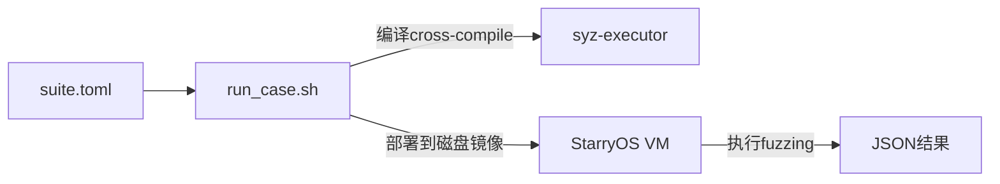

# Syzkaller 内核 Fuzzing 集成计划

## 什么是 Syzkaller

Syzkaller 是 Google 开发的覆盖率引导的内核模糊测试工具，专门用于发现操作系统内核漏洞。已在 Linux 内核中发现数千个 bug。**GitHub**: https://github.com/google/syzkaller**核心特性**:

- 覆盖率引导的智能 fuzzing
- 支持多种架构 (x86_64, aarch64, etc)
- 自动生成系统调用序列
- 检测崩溃、死锁、内存泄漏等问题

## StarryOS 是 Rust 内核 - 关键差异

**重要**: StarryOS 是用 **Rust 编写的操作系统内核**，这与 Syzkaller 主要针对的 C 语言 Linux 内核有本质区别：

### Rust 内核的优势

-  **内存安全** - 编译期防止缓冲区溢出、use-after-free、double-free
-  **类型安全** - 强类型系统防止很多类型混淆错误
-  **所有权系统** - 自动管理资源生命周期

### Rust 内核仍可能存在的问题 (Fuzzing 重点)

-  **逻辑错误** - Rust 无法防止业务逻辑 bug
-  **Panic** - unwrap()/expect() 失败、数组越界、整数溢出
-  **并发问题** - 死锁、活锁、数据竞争 (unsafe 代码)
-  **资源泄漏** - 文件描述符、内存未正确释放
-  **unsafe 代码** - 系统调用实现中的 unsafe 块可能有问题
-  **系统调用语义** - 实现不符合 POSIX 规范
-  **边界条件** - 极端参数、资源耗尽时的行为

### 针对 Rust 内核的 Fuzzing 策略

**不同于 C 内核的测试重点**:

1. **寻找 panic 而非段错误** - 关注 unwrap/expect/assert 失败
2. **测试 Result/Option 的错误路径** - 确保错误处理正确
3. **并发压力测试** - 多线程下的 Mutex/RwLock 死锁
4. **资源限制测试** - 观察资源耗尽时是否正确返回错误
5. **unsafe 代码审查** - 系统调用中的 unsafe 块是重点

**参考 Syzkaller 但调整目标**:

- 借鉴其系统调用序列生成和参数随机化方法
- 但预期发现的是逻辑错误和 panic，而非内存破坏

## StarryOS 系统调用支持情况

根据 `/home/yean/code/StarryOS/api/src/syscall/mod.rs` 分析，StarryOS 已经实现了 **200+ 系统调用**

## 集成策略

### 方案选择: 轻量级集成 (参考 Syzkaller )

由于完整的 Syzkaller 部署较为复杂 (需要 Go 环境、覆盖率支持等)，采用**轻量级集成方案**:

1. **Rust 实现 fuzzer** - 参考 Syzkaller 的系统调用描述和测试策略
2. **针对 StarryOS 定制** - 只测试 StarryOS 已实现的 200+ 系统调用
3. **复用现有框架** - 通过 `run_case.sh` 部署和执行
4. **JSON 输出** - 与现有测试保持一致的输出格式

### 目前准备: 手动测试用例 (简化版)

**目标**: 不依赖完整 Syzkaller 环境，手动编写 Rust 程序模拟 fuzzing 逻辑**实现**:

- 创建 `tests/stress/cases/syscall_fuzzer/` Rust 项目
- 参考 Syzkaller 的系统调用描述 (syscall descriptions)
- 随机生成系统调用参数和序列
- 检测异常退出、panic、超时

**参考**:

- Syzkaller syscall descriptions: https://github.com/google/syzkaller/tree/master/sys/linux
- 可以"抄袭"其测试用例结构，用 Rust 重新实现

**优点**:

- 完全控制，易于调试
- 无需 Go 环境和覆盖率工具
- 与现有框架无缝集成

